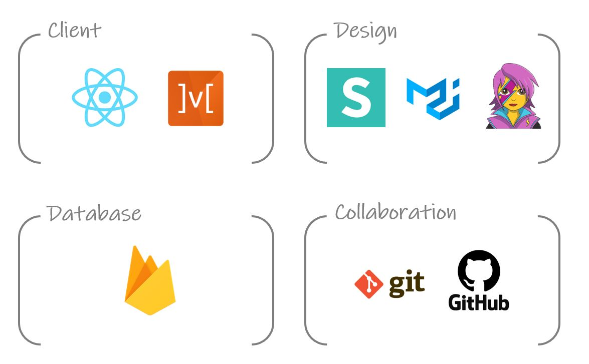

👇클릭해서 홈페이지로 이동하기👇


# 🦄Happy New Ear🦄

           

> 귀염뽀짝한 에어팟 케이스들은 다 여기있다!
>
> 에어팟 악세사리 쇼핑몰 **Happy New Ear** 입니다.
>
> **(진행중, 완성도 70%)**


## 📺[Demo Video](https://www.youtube.com/watch?v=YOCiTByHRqs) 


## 📚Wiki

##### ✔️Develop Period : 2020.08.14 ~ 2020.08.20

##### ✔️Developer

|               Developer                | 💻what did I do                                               |
| :------------------------------------: | :----------------------------------------------------------- |
| 🙂[곽병선](https://github.com/kwak-bs)  | 카테고리 페이지 기능 구현<br />상세페이지 UX/UI<br />메인 페이지 기능 구현 |
| 🙂[이연주](https://github.com/Joylish)  | 로그인/회원가입 기능 구현,<br />로그인/회원가입 UX/UI<br />데이터 베이스/라우터 연동 |
|  🙂[조성원](https://github.com/JSWww>)  | 장바구니 기능 구현<br />메인 페이지 기능 구현<br />메인 페이지 UX/UI |
| 🙂[하태린](https://github.com/hataerin) | 상세페이지 기능 구현<br />슬라이더 기능 구현<br />장바구니 UX/UI |


## ⚙️Install & Run

- install

  ```Shell
  $ cd FE
  $ npm install
  ```

- Run

  ```shell
  $ npm start
  ```


## 🔨Tech Stack

 


# 🗃️Project Folder

```
📁config
📁node_modules
📁public
├── 📁data
├── 📁images
├── index.html
📁script
📁src
├── 📁components
├── 📁containers
├── 📁data
├── 📁pages
├── 📁store
├── App.js
├── index.js
└── Root.js
```


## 📌주요 기능

#### **1. Sign Up / Sign In**   

- 고객은 구글 계정으로 로그인하여 서비스를 사용할 수 있습니다.
- 고객의 회원 가입 정보 입력 후 회원 정보 DB에 저장되어야 합니다

#### 

#### **2. Page Router**

- 고객은 특정 주소에 따라 특정 데이터에 직접 접근할 수 있습니다.
- 브라우저는 특정 주소에 따라 파일을 로드 하여 렌더링합니다. 
  {: width="10%" height="10%"}

#### **3. Header**

- 브라우저는 스크롤 이벤트와 관계 없이 헤더를 상단에 고정시킵니다. 
- Posiotion : fixed, z-index 적용


#### **4. Main Page**

- 메인 페이지는 상품 기획시리즈를 슬라이딩하여 보여줍니다.
- 고객은 카테고리별 최신상품 4개씩 미리 볼 수 있습니다. 
- 고객은 카테고리 이름을 클릭하여 카테고리별 상품을 볼 수 있습니다.
- 고객은 상품 이미지를 클릭하여 상품 상세 정보를 볼 수 있습니다. 


#### **5. Category Paage**

- 카테고리 페이지는 카테고리에 따라 상품 목록과 인기 상품을 보여줍니다.


#### **6. Detail Page**

- 상세 페이지는 상품에 대한 판매가, 상품이름, 배송비, 수량, 최종 가격정보를 보여줍니다. 


#### **7. Cart Page**

- 고객은 상품 선택 및 삭제에 따라 예상 주문금액을 알 수 있습니다.  


## ❗️회고

- **이연주** 

  - 작성할것
  * 작성할것 
  + 작성할것 
  - 작성할것 

- **곽병선**  
  - 첫 리액트 프로젝트이여서 부족한 점이 상당히 많았지만, 프로젝트를 진행하면서 리액트의 역량을 최대한으로 끌어 올릴 수 있는 계기가 되었다.
  * 메인 페이지의 카테고리별 Preview List를 출력할 때, 카테고리의 아이템들중 4개만을 출력하여야 하는데 조건을 사용하는 방법이 미숙하였다. 하지만 Filter를 사용하여 쉽게 해결할 수 있었다. 어렵지 않은 문제였는데 시간을 많이 쏟아서 자존심이 상하였지만 혼자 해결했다는 마음에 뿌듯했다. 첫 해결 코드 : const prevItems = items.filter(tmp => tmp.id < 5); 
  + 고객이 상세페이지에서 수량을 설정하여 버튼을 클릭하였을 때, 장바구니에 적용하는 로직이 생각보다 쉽지 않았다. Semantic 라이브러리의 Dropdown을 사용하였지만 Value값을 부모 컴포넌트에 보내는 것이 쉽지 않았다. 결국 우리 팀장님의 도움을 받았다. 해결방법은 부모 컴포넌트(Container)에 리턴값으로 e.tartget을 보낸 후 정규표현식과 ㅇㅁ릔으림ㅇ르밍르매댜름ㅇㄴㄹ ㅢ아르 ㅁ 
  - 협업 툴을 제대로 사용할 수 있는 계기여서 좋았다. 이번 기회에 GitHub를 많이 사용해보았고 Pull Request를 많이 경험하고 구글 미트를 통해 온라인상에서 화상으로 프로젝트를 함께 진행할 수 있어서 더 좋았다. 

- **조성원** 
  - 작성할것
  * 작성할것
  + 작성할것
  - 작성할것

- **하태린** 
  - 작성할것
  * 작성할것
  + 작성할것
  - 작성할것


## 💪Show your support!

Give a ⭐️ if this project helped you!